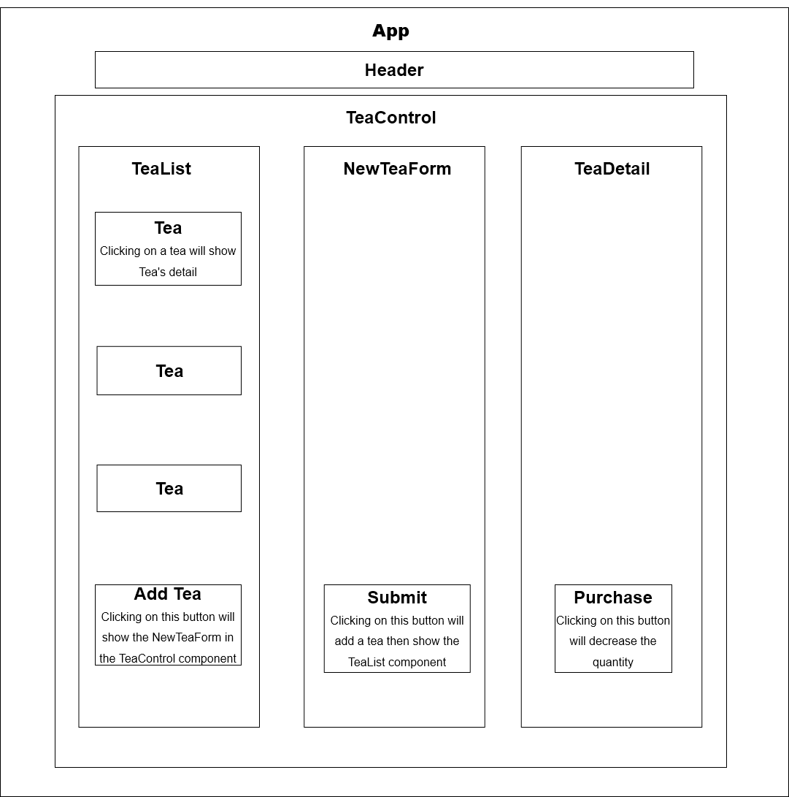

# Kyle's Tea Shop

#### By Kyle Miller

## Technologies Used
* React
* JavaScript 
* HTML
* CSS
* Bootstrap
* Markdown

## Description:
_This application was created to utilize add & deltete teas using CRUD functionality. Users can view tea details, add, and buy teas. If a user purchases a tea, the quantity is reduced by one ounce._



## Setup/Installation Requirements

* Clone or download this repository onto your desktop.
* Navigate to the top-level of directory.
* Open VScode.

#### Build Environment
* _Install packages:_
```
$ npm install
```

* **To Run the Server/App**:  
1. Run `npm run start` in the terminal to run a server. This will start a server, which you can access by entering `localhost:3000` in your browser.

## Known Bugs

- _N/A_

## License

- N/A Copyright (c) 8/14/2022, Kyle Miller
- _[MIT](https://opensource.org/licenses/MIT)_